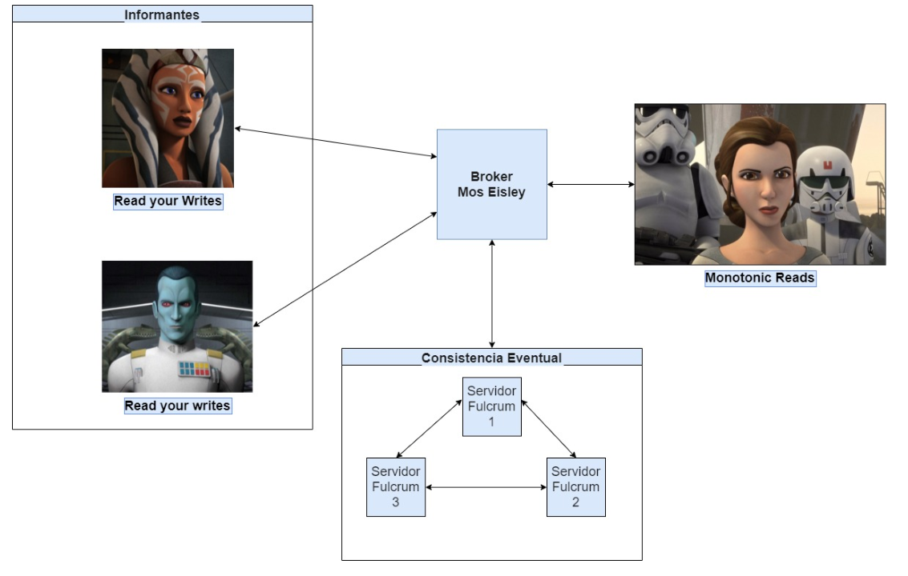

# Tarea Sistemas Distribuidos

Felipe Aguirre

25 Enero 2022

## Sistema distribuido inspirado en el universo de starwars:

### Arquitectura del sistema

El sistema distribuido está compuesto por 5 entidades: La princesa Leia, Ahoska Tano, el Almirante Thrawn, el Broker Mos Eisley y los servidores Fulcrum.




### Read your writes y Monotonic Reads

Para mantener los modelos de consistencia monotonic reads y read your writer, el broker realiza comparativas entre relojes de vector. Revisando si el vector almacenado por el informante o Leia es mayor o igual al vector de cada uno de los servidores Fulcrum. 

Ya sea en la primera conexión por archivo planetario, o cuando ya existe consistencia eventual, el Broker asigna aleatoriamente una IP dentro de las candidatas.

### Consistencia eventual y Merge

La consistencia eventual se realiza utilizando el servidor Fulcrum 1 como servidor primario:

1. El servidor Fulcrum 1 envia un request a los servidores 2 y 3, solicitando sus logs y sus relojes de vectores asociados a cada planeta.
2. Luego, Fulcrum 1 aplica sobre su data los comandos recogidos de los logs, para así generar un nuevo conjunto de archivos de planeta que contengan los cambios realizados en los 3 servidores.
3. Del mismo modo, Fulcrum 1 combina los relojes de vectores de cada servidor para generar un único vector con todos los cambios incluidos.
4. Finalmente, se envía a Fulcrum 2 y 3 los nuevos registros de planeta junto con el vector actualizado.

Se observa que los conflictos quesan "sobreescritos" teniendo preferencia la última escritura que recibe Fulcrum 1, es decir:

Fulcrum 3 > Fulcrum 2 > Fulcrum 1 en orden de prioridad de aplicación de cambios


## Instrucciones de instalación

Es necesario instala golang siguiendo las [instrucciones correspondientes a cada sistema operativo](https://go.dev/dl/)


### Generación de protobuffers:

Instalar protoc mediante 

```
go get -u github.com/golang/protobuf/protoc-gen-go@v1.3.2
```

Ejecutar en la carpeta raíz

```
protoc --go_out=. --go_opt=paths=source_relative --go-grpc_out=. --go-grpc_opt=paths=source_relative protos/protos.proto

```


### Arranque de archivos

- Broker
  ```
  go run broker/broker_mos_eisley.go
  ```
- Informante 1 - Ahoska Tano
  ```
  go run informante_1/ahoska_tano.go
  ```

- Informante 2 - Almirante Thrawn

  ```
  go run informante_2/almirante_thrawn.go
  ```

- Princesa Leia

  ```
  go run leia/leia.go
  ```

- Fulcrum 1

  ```
  cd servidor_fulcrum_1
  go run servidor_fulcrum_1.go
  ```

- Fulcrum 2

  ```
  cd servidor_fulcrum_2
  go run servidor_fulcrum_2.go
  ```

- Fulcrum 3

  ```
  cd servidor_fulcrum_1
  go run servidor_fulcrum_3.go
  ```

  Notar que es necesario cambiar de carpeta al ejecutar los servidores Fulcrum, esto se debe a la manera en que se crean los archivos .log y .txt de cada servidor.

